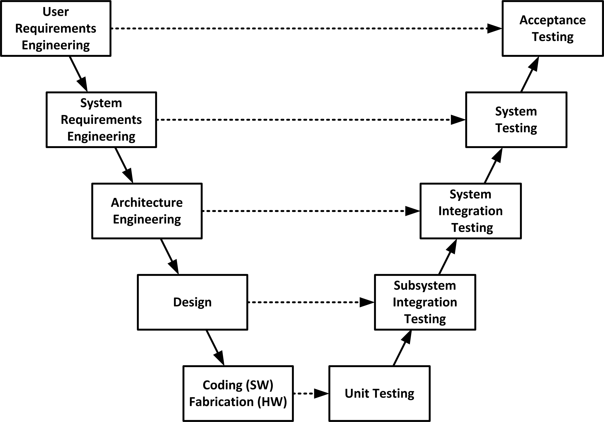

# Development Process Description

## Overview

This document describes the development process followed for this embedded systems project. The process is based on an **iterative V-Model** that balances structured documentation with practical incremental development.

---

## Stakeholders

| Stakeholder | Role | Interest |
|-------------|------|----------|
| **Developer** | Implements and tests the BMS | Delivers functional, safe system meeting all requirements |
| **Portfolio Reviewer** | Evaluates project quality (employer) | Sees professional engineering practices, standards compliance, traceability |
| **End User** | Uses the battery pack | Safe, reliable operation without fire or explosion risk |

---

## V-Model Overview

*Figure 1: V-Model showing left-side definition, right-side verification, and validation checkpoints*

---

## Mapping to This Project

| Standard V-Model Stage | Project Artifact |
|------------------------|------------------|
| User Requirements | HARA |
| System Requirements | SRS |
| Architecture / Design | SDD |
| SW Coding | `Core/Src/` |
| Unit Testing | `docs/tests/unit/` |
| Integration Testing | `docs/tests/integration/` |
| System Testing | `docs/tests/system/` |
| Acceptance Testing | HARA validation |

*Note: Hardware stages (Fabrication, Engineering) are not applicable as this is a software-only project.*

---

## Horizontal Verification (Validation)

At each stage, the output is verified against the previous stage:

| Stage | Verification | Evidence |
|-------|--------------|----------|
| User Requirements → System Requirements | Requirements satisfy stakeholder needs | HARA document, review |
| System Requirements → Design | Design satisfies all requirements | SDD traceability table |
| Design → Code | Code matches design | Code review, coding style guide |
| Code → Unit Tests | Individual functions correct | Unit test results |
| Design → Integration Tests | Modules work together | Integration test results |
| Requirements → System Tests | System meets requirements | System test results |
| User Requirements → Acceptance | System satisfies stakeholder | Acceptance test report |

---

## Risk Management

Risks are identified and managed through:

| Risk Document | Coverage |
|---------------|----------|
| [Hazard Analysis (HARA)](docs/HARA.md) | Safety hazards, ASIL classification, safety goals |
| [Test Plan](docs/TEST_PLAN.md) Section 9 | Project risks (R-01 to R-04) |

**Risk mitigation follows the V-Model:**
- Risks identified during requirements analysis
- Risks designed out during system architecture
- Residual risks verified during integration and system testing

---

## Configuration Management

| Practice | Implementation |
|----------|----------------|
| **Version control** | Git with GitHub repository |
| **Change tracking** | Commit messages follow Conventional Commits specification |
| **Document versioning** | Revision History table in each document (SRS, SDD, TEST_PLAN, etc.) |
| **Baselining** | GitHub releases for major milestones |
| **Change review** | Pull requests with self-review before merge |

---

## Iterative Development Process

For each feature, the project follows this cycle:

| Step | Action |
|------|--------|
| 1 | Write requirement |
| 2 | Horizontal check: Does requirement meet stakeholder needs? |
| 3 | Create design |
| 4 | Horizontal check: Does design satisfy requirement? |
| 5 | Implement code |
| 6 | Horizontal check: Does code match design? |
| 7 | Test the feature |
| 8 | Horizontal check: Does test verify the code? |
| 9 | Move to next feature |

---

## Typical Iterations

| Iteration | Feature | Horizontal Check | Test |
|-----------|---------|------------------|------|
| 1 | Platform (LED, toolchain) | Code matches design | LED blinks |
| 2 | Communication (I2C) | Design satisfies comms requirement | Bus scanner passes |
| 3 | Sensor read | Code implements sensor read correctly | Value matches reference |
| 4 | Data processing | Design handles edge cases | Unit tests pass |
| 5 | Control logic | Logic matches safety requirements | Fault injection passes |
| 6 | Full integration | All horizontal checks pass | End-to-end passes |

---

## Artifacts Produced

| Artifact | Purpose | Verified By |
|----------|---------|-------------|
| HARA | Safety risk assessment | User requirements validation |
| SRS | What the software must do | System tests, requirements validation |
| SDD | How the software is built | Integration tests, design verification |
| Test Plan | Verification strategy | Requirements traceability |
| Test Specification | Detailed test cases | Design traceability |
| Traceability Matrix | Requirements → Tests | All verification stages |
| Coding Style Guide | MISRA/CERT C standards | Static analysis (Cppcheck) |

---

## Process Effectiveness Metrics

| Metric | Target | Measurement |
|--------|--------|-------------|
| Requirements traceability | 100% | Traceability matrix shows all REQ IDs mapped to test cases |
| Static analysis pass rate | 100% | Cppcheck reports zero violations (with documented suppressions) |
| Test pass rate | 100% | All test cases marked "Pass" in execution log |
| Document completeness | All sections filled | Self-review and peer review before commit |

---

## Key Principles

- Build one feature at a time
- Perform horizontal checks at each stage
- Test before adding next feature
- Every requirement has a test
- Static analysis catches issues early

---

## Standards Alignment

| Standard | How Met |
|----------|---------|
| ISO 15288 (system life cycle) | V-Model process with horizontal verification, stakeholder identification, risk management |
| ISO 29148 (requirements) | SRS document + requirements validation |
| ISO 26262 (functional safety) | HARA document + safety validation + ASIL classification |
| MISRA C:2012 | Coding style guide + static analysis (Cppcheck) |
| CERT C | Coding style guide + static analysis (Cppcheck) |

---

## How to Use This Process

1. Start with a single feature (e.g., I2C communication)
2. Write requirement for that feature
3. Perform horizontal check: Does requirement meet stakeholder needs?
4. Create design for that feature
5. Perform horizontal check: Does design satisfy requirement?
6. Implement code for that feature
7. Perform horizontal check: Does code match design?
8. Test the feature
9. Perform horizontal check: Does test verify the code?
10. Move to next feature and repeat

---

## Version History

| Version | Date | Change |
|---------|------|--------|
| 1.0 | 2026-05-05 | Initial process description with V-Model mapping |
| 1.1 | 2026-05-12 | Added stakeholders, risk management, configuration management, process metrics |

---

*End of Process Description*